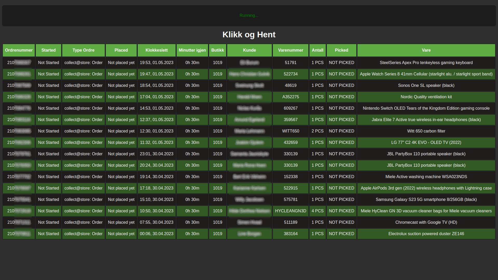
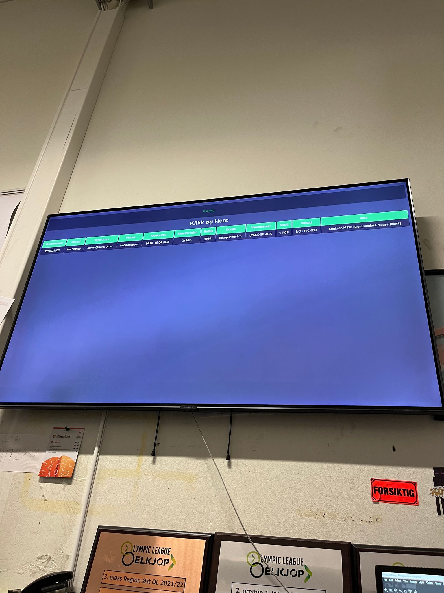

# Click and Collect Live Overview

Elkjøp's internal click and collect system does not auto-update once a customer order a product, which creates problems for the employees. My supervisor asked for a solution.

This solves that problem by constantly checking for changes in the internal system and displaying the orders in a more structured manner.

